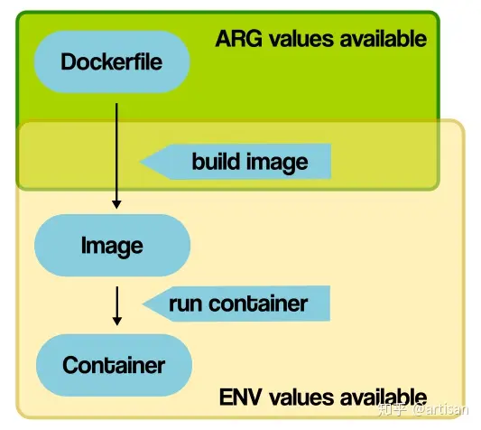

- RUN、COPY 和 ADD 指令会在已有镜像层的基础上创建一个新的镜像层，执行指令产生的所有文件系统变更会在指令结束后作为一个镜像层整体提交。
- 镜像层具有 copy-on-write 的特性，如果去更新其他镜像层中已存在的文件，会先将其复制到新的镜像层中再修改，造成双倍的文件空间占用。
- 如果去删除其他镜像层的一个文件，只会在当前镜像层生成一个该文件的删除标记，并不会减少整个镜像的实际体积。

- docker history 命令，该命令可以展示所有镜像层的创建时间、指令以及体积等较为基础的信息.
- 第三方的 dive 工具，该工具可以分析镜像层组成，并列出每个镜像层所包含的文件列表，可以很方便地定位到影响镜像体积的构建指令以及具体文件。

- 分阶段构建与从零构建
from target scratch

- 避免产生无用的文档或缓存

- 及时清理不需要的文件,RUN 指令的结尾处立刻清理

- 复制文件的同时修改元信息
修改文件元信息也会将文件复制到新的镜像层,COPY 和 ADD 指令都提供了修改元信息的 --chmod 和 --chown 选项

- CMD/RUN 语句中使用字符串作为参数时，这些参数会被放到 /bin/sh 中执行

- busybox:glibc

- .env 文件，仅在compose.yml文件工作时的预处理步骤过程使用
- ARG仅在构建Docker映像期间（RUN等）可用，而在创建映像并从其启动容器（ENTRYPOINT，CMD）之后不可用
- ENV值可用于容器
- ${VARIABLE_NAME} / VARIABLE_NAME=some value
